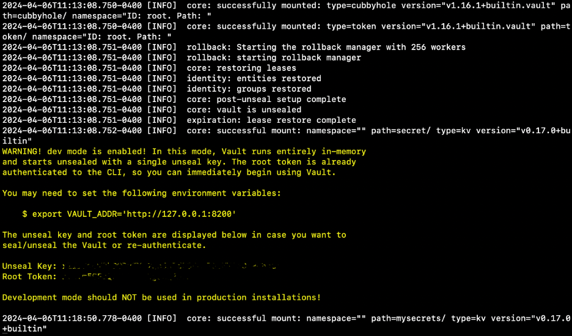
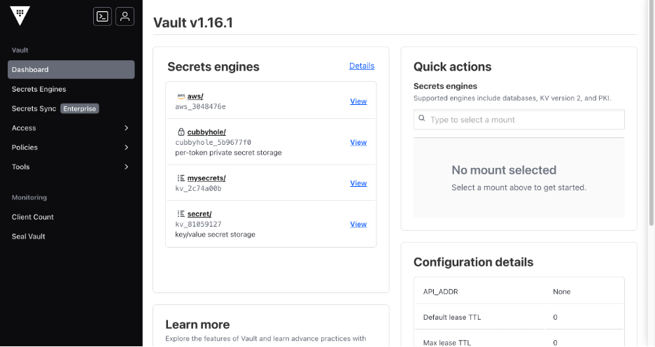
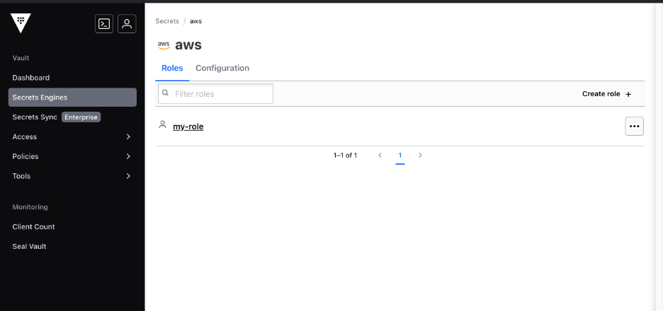
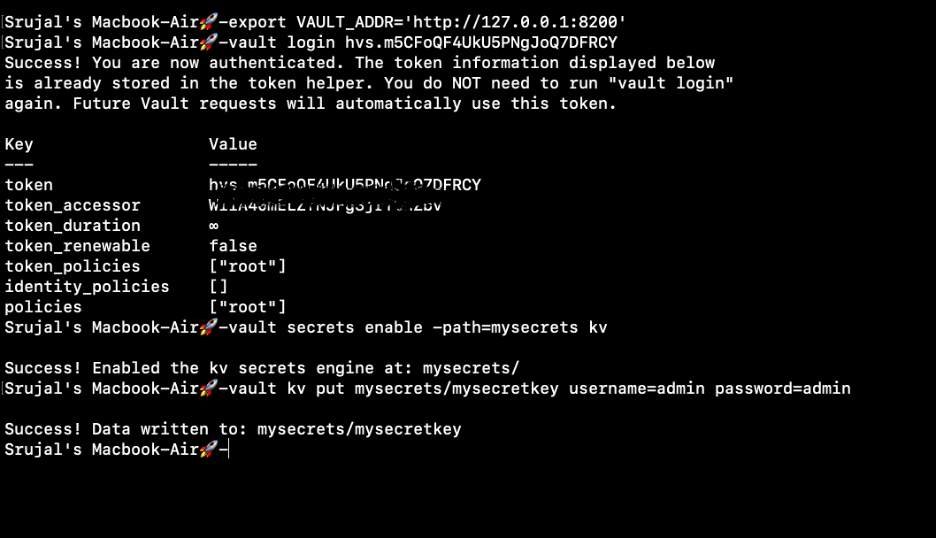
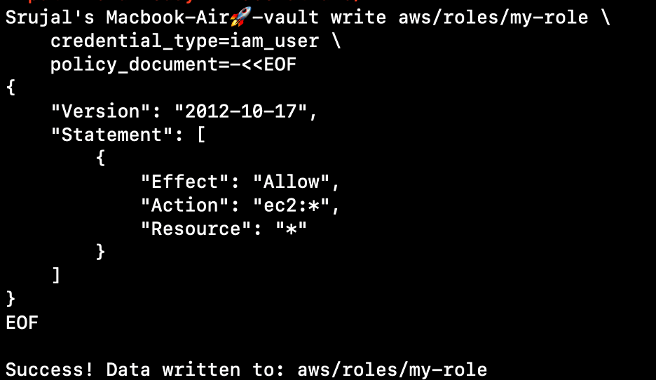
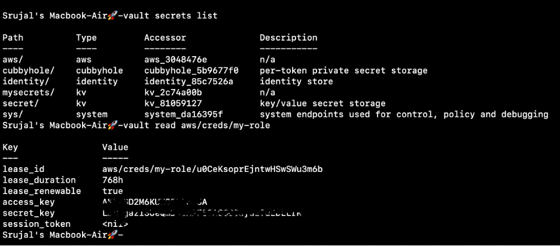
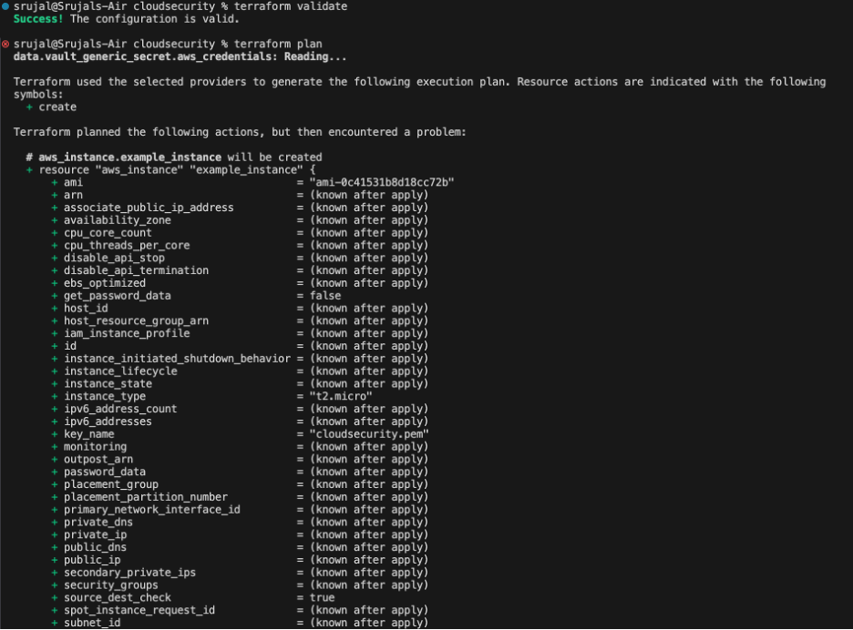
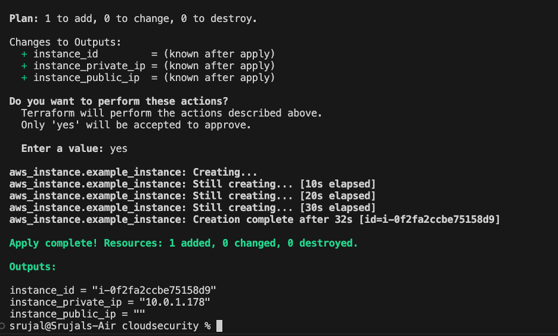
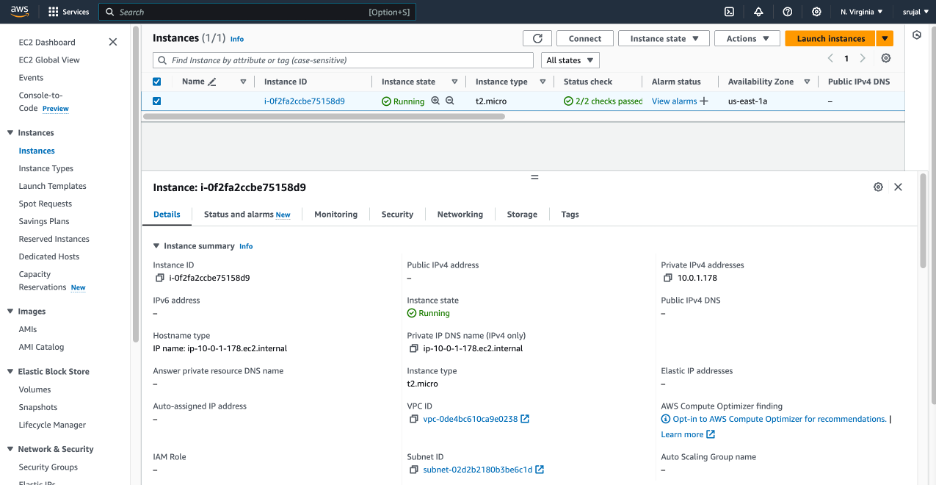
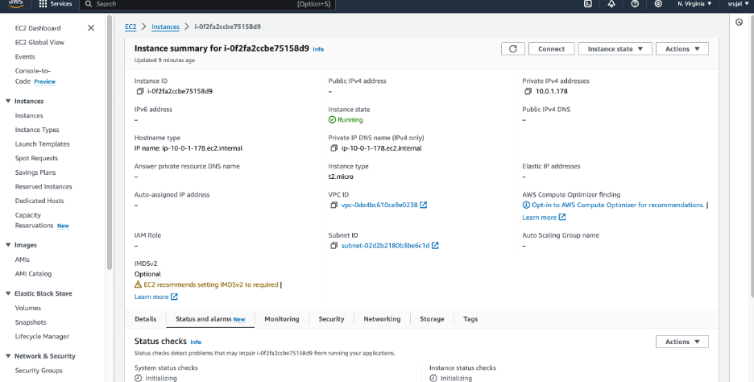

# Setting up Vault and AWS Infrastructure with Terraform

This lab demonstrates how to set up HashiCorp Vault and provision AWS infrastructure using Terraform.

## Introduction

This project provides detailed instructions on setting up HashiCorp Vault and provisioning AWS infrastructure with Terraform. It covers setting up Vault, enabling the AWS secrets engine, creating IAM policies and roles, and provisioning AWS infrastructure using Terraform.

## 1 Setup Vault

```
vault server -dev
```

### Set Vault Address

Set the Vault address environment variable to connect to the locally running Vault server:



## 2.Enable AWS Secrets Engine
```
export VAULT_ADDR=http://127.0.0.1:8200
vault secrets enable aws
```
Simply we can check the successfull implementation of the policies and roles via this url http://127.0.0.1:8200.



Enable AWS Secrets Engine
Enable the AWS secrets engine in Vault:


## 3. Create IAM Policy And Roles

```
path "aws/creds/my-role" {
  capabilities = ["read"]
}
```

## 4.Create AWS Vault Role

```
vault write aws/roles/my-role credential_type=iam_user policy_document=-<<EOF
{
    "Version": "2012-10-17",
    "Statement": [
        {
            "Effect": "Allow",
            "Action": "ec2:*",
            "Resource": "*"
        }
    ]
}
EOF
```
## 5.Provision AWS Infrastructure with Terraform

Clone Repository
Clone this repository:
```
git clone https://github.com/yourusername/your-repo.git
```
## 6.Navigate to Project Directory

Navigate to the project directory:
Initialize Terraform
Initialize Terraform:
```
terraform init
terraform plan
```
Apply Terraform Plan
Apply the Terraform plan:
```
terraform apply
```
Confirm and type "yes" when prompted.

## 7. Verify the cloud console

Verify Infrastructure:

Verify that the AWS infrastructure has been provisioned successfully.




Additional Resources

[HashiCorp Vault Documentation](https://www.vaultproject.io/docs)

[Terraform Documentation](https://www.terraform.io/docs/index.html)

[AWS Documentation](https://docs.aws.amazon.com/index.html)

